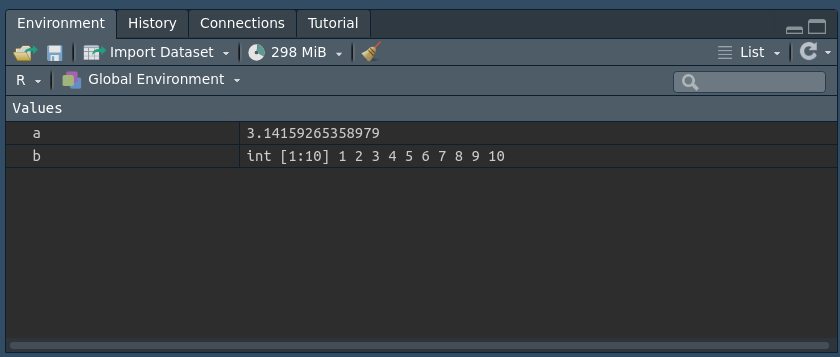

<div class="title-logo"></div>

```{r packages_setup, echo=FALSE, message=FALSE, warning=FALSE}
knitr::opts_chunk$set(echo = T, warning = F, message = F)
knitr::opts_chunk$set(fig.width=8, fig.height=6) 
```

# El lenguaje de programación R

R es un **software libre** de programación especializacido en estadística. RStudio es una interfaz que facilita la programación en R.

- R: lenguaje de comunicación
- RStudio: forma de comunicarse con máquina

```{r, echo=FALSE, out.width = '80%',  fig.align='center'}
knitr::include_graphics("img/r-rstudio.png")
```


```{r, echo=FALSE, out.width = '70%',  fig.align='center'}
knitr::include_graphics("img/RGUI.png")
```

En el siguiente enlace puede encontrarse información acerca de la instalación de R y RStudio en diferentes sistemas operativos.

[https://rstudio-education.github.io/hopr/starting.html](https://rstudio-education.github.io/hopr/starting.html).


# Ejecutar comandos en R

Nos comunicamos con R a través de la consola de comandos. Por ejemplo,
con el siguiente código damos a R la orden de multiplicar 123 por 65.

```{r, echo=TRUE}
123 * 65
```

La respuesta en consola aparece como

```{r, echo=FALSE, out.width = '20%',  fig.align='center'}
knitr::include_graphics("img/console.png")
```

Suele ser buena práctica explicar el código que se crea. Esto se hace a través de comentarios. Los comentarios se inician con el caracter #. De esta manera, R reconoce que lo que sucede a este caracter es un comentario y no lo ejecuta. Por ejemplo:

```{r, echo=TRUE}
# Esto es un comentario
# Este código multiplica 100*12
100*12
```

# R como calculadora

Podemos usar R como calculadora. Algunas operaciones básicas son:


```{r, echo=TRUE}
# Suma
2+2

# Resta
2-2

# Multiplicación
2*3

# Divisón
2/3

# Potencias
2^3

# Potencias (otra forma)
2**3

# Raíz cuadrada
sqrt(9)

# Logaritmo Natural
log(100)

# Logaritmo en base 10
log(100,10)

# Exponencial
exp(1)

# Valor Absoluto
abs(-4)

# Factorial
factorial(3)

# Combinaciones de 4 en 2
choose(4,2)
```

Ante operaciones de resultado indeterminado, R devuelve un NaN (not a number).

```{r, echo=TRUE}
0/0
```

## Tu turno

Escribe y ejecuta las siguientes operaciones aritméticas en R:

* Suma dos más 3

* Calcula 2 elevado a 100, ¿qué observas?

* Calcula el logaritmo en base dos de 1024

```{r}
## Tu código aquí
```

# Asignando valores

Si queremos un valor (o conjunto de valores) de forma recurrente hay que **guardarlos en memoria**, dándole un nombre.

```{r, echo=TRUE}
# Esto crea un objeto de R con valor pi
a <- pi
# Sumo 3 al valor guardado
a + 3
```

Puedes nombrar un objeto en R casi cualquier cosa que quieras, pero hay algunas reglas. Primero, un nombre no puede comenzar con un número. Segundo, un nombre no puede usar algunos símbolos especiales, como ^, !, $, @, +, -, / o *
Tercero, evita espacios en los nombres: en lugar de `mi nombre` usa `mi_nombre`.

Podemos guardar múltiples valores

```{r, echo=TRUE}
# Esto guarda los números del 1 al 5
b <-1:5
b
```

Podemos concatenar valores 

```{r}
# Esto hace lo mismo que el trozo anterior, pero de forma manual
nums <- c(1,2,3,4,5)
```

Los objetos guardados aparecen en la ventana de *Environment* de RStudio

```{r, echo=FALSE, out.width = '100%',  fig.align='center'}

```

El nombre de un ojeto no puede empezar con un número, ni tampoco incluír ciertos caracteres especiales como `^`, `$`, `@`, etc.

**Importante**: R sobre-escribe. Observa lo que sucede en este código.

```{r, echo=TRUE}
c <- 5
c
c <- 20
c
```

# Tipos de Variables

Los tipos más importantes son:

* Numéricas

* Caracteres. ¡Con comillas!

* Lógicas (toma valores `TRUE` o `FALSE`. También `T` o `F`)

Puedes comprobar el tipo de una variable con el comando `class(x)` o `typeof(x)`:

```{r}
num <- 3
class(num)

color <- "negro"
class(color)

logica <- F
class(logica)

logica <- TRUE
class(logica)
```

Es posible cambiar el tipo de variables usando:

* `as.numeric(x)` 

* `as.character(x)` 

* `as.logical(x)`


## Tu turno

* Crea una variable con el nombre que desees que almacene los valores "Negro", "Blanco" y "Verde".  Determina el tipo de esta variable.

* Crea una variable con el nombre que desees que almacene los valores 3, 4 y "Verde".  Determina el tipo de esta variable. ¿Qué sucede?

* Crea una variable con el nombre que desees que almacene los valores TRUE, FALSE y "False".  Determina el tipo de esta variable. ¿Qué sucede?

```{r}
## Tu código aquí
```

# Funciones de redondeo

```{r}
x <- 2.17
# Redondea con 1 dígito de precisión al número más cercano
round(x, digits=1)

# Toma el entero inmediatamente anterior
floor(x)

# Toma el entero inmediatamente superior
ceiling(x)
```

# Ejercicios

1. Ejecuta una expresión en R, por ejemplo `5 -`. ¿Qué sucede?

2. Divide 6 entre el resultado de restar 4 menos 1. 

3. Realiza los siguientes pasos:

  * Escoge cualquier número y guárdalo en una variable llamada x

  * Suma dos a x
  
  * Multiply en resultado anterior por 3
   
  * Resta 6 del resultado anterior
  
  * Divide lo que hayas obtenido en el paso anterior por 3
  
  ¿Qué obtienes?
  
4. Crea una variable llamada Numero que contenga el número 3 y otra llamada numero que también contena el valor 6. Suma 7 a la variable Numero, ¿qué obtienes?

5. Utiliza la ayuda para determinar la utilidad de la función `ls()`
. ¿Qué obtienes al ejecutarla?


